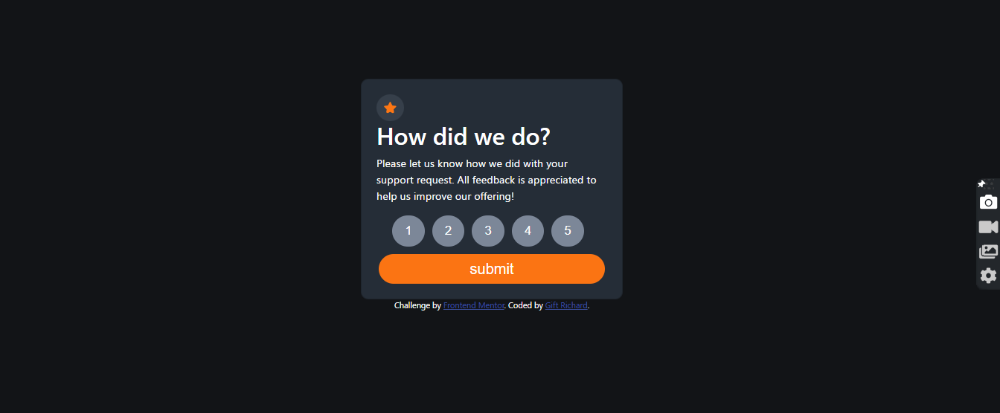

# Frontend Mentor - Interactive rating component solution

This is a solution to the [Interactive rating component challenge on Frontend Mentor](https://www.frontendmentor.io/challenges/interactive-rating-component-koxpeBUmI). Frontend Mentor challenges help you improve your coding skills by building realistic projects. 

## Table of contents

- [Overview](#overview)
  - [The challenge](#the-challenge)
  - [Screenshot](#screenshot)
- [My process](#my-process)
  - [Built with](#built-with)
  - [What I learned](#what-i-learned)
  - [Useful resources](#useful-resources)
- [Author](#author)

## Overview

### The challenge

Users should be able to:

- View the optimal layout for the app depending on their device's screen size
- See hover states for all interactive elements on the page
- Select and submit a number rating
- See the "Thank you" card state after submitting a rating

### Screenshot

## My process

### Built with

- Semantic HTML5 markup
- CSS custom properties
- Flexbox
- [Styled Components](https://getbootstrap.com/) - For styles

### What I learned

at the point of writing this, i was fairly new to javascript so this atsk served as a source sourse of knowledge and experience. i would say ony of the major thing i learned with is quite simple tho, was .textcontent

## Author

- Website - [Gift Richard](https://giftportfolio.netlify.app/)
- Frontend Mentor - [@fibonacci001](https://www.frontendmentor.io/profile/fibonacci001)